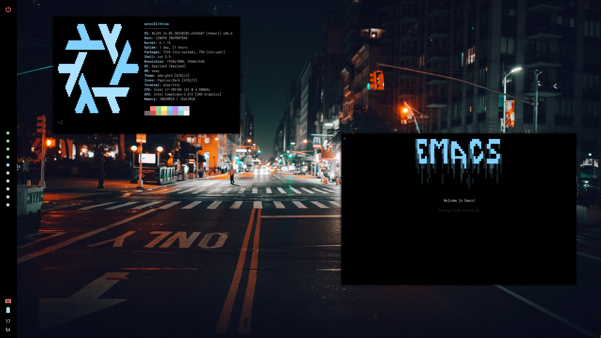
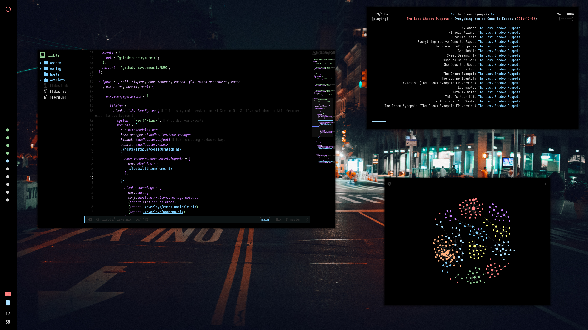

# NixOS Dotfiles

---

Disclamer: You **should not** blindly copy these dotfiles.

---

## Setup

- Get the latest minimal NixOS ISO. I get it from [here](https://channels.nixos.org/). You may want a slightly more stable ISO, not that it matters, since we're using the unstable channel.
- Depending on which host you want to set up, you'll have to follow different instructions, each in `./hosts/<host>/readme.md`.
- Once setup is done, use the `nas` tool to rebuild your configuration easily

## Why NixOS?

- Declarative package installation and configuration management
- Lots of packages (80k+)
- Rollbacks of configurations
- Reliablity
- Reproducible environments

## Some notes

This isn't a fancy configuration intended to be easily modified by other people. I've got some hardcoded user paths that you need to change if you want to change the username, some configurations that make sense for me, and settings that change all the time. You'll probably need to modify this manually to suit your needs, but it works for me. If you're merely using this as a starting point for Nix/NixOS, it _should_ in theory be fine, although I might not be following best practices.

## Details

|-------------|-----------|
| Compositor  | Hyprland  |
| Terminal    | Alacritty |
| Text editor | Emacs     |
| Widgets     | Eww       |

## Screenshots

