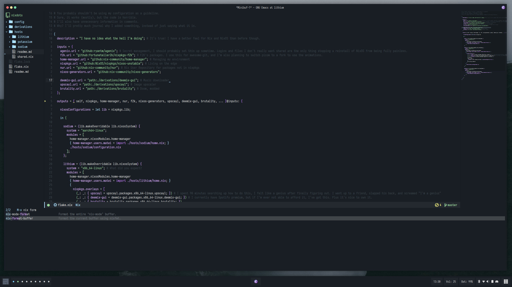
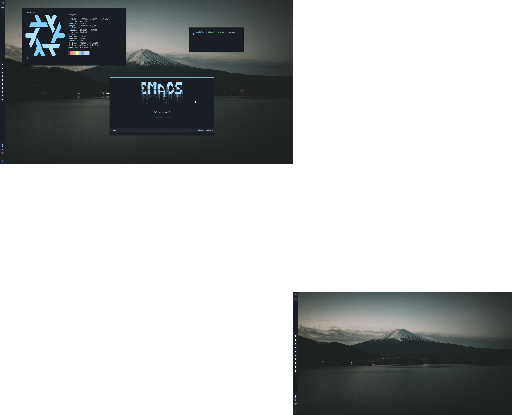

# NixOS Dotfiles

---

Disclamer: You **should not** blindly copy these dotfiles.

---

## Setup

- Get the latest minimal NixOS ISO. I get it from [here](https://channels.nixos.org/). You may want a slightly more stable ISO, not that it matters, since we're using the unstable channel.
- Boot into the installer and mount the disks.
  - Depending on which host you want to set up, you'll have to follow different instructions, each in `./hosts/<host>/readme.md`.
- Get a nix shell with `git` and `nix flake` set up: `nix-shell -p git nixFlakes`.
- Clone these dotfiles to `/etc/nixos`: `git clone https://github.com/mcotocel/nixdots /mnt/etc/nixos`.
  - At this point, it would be smart to edit the `hardware.nix` file to suit your hardware, and additionally add or remove things you need or don't need.
- Install NixOS using the flake: `nixos-install --root /mnt --flake /mnt/etc/nixos#host --impure`.
  - Host is the host you want to install. A list of hosts is in `./hosts`.
- Reboot and change the user password. Unless you want to use root the whole time, which is stupid.
- Log in as the normal user and run `cp -R /etc/nixos ~/nixdots` to pull the config to your home folder.
- Use the `nas` tool to rebuild your configuration.

## Why NixOS?

- Declarative package installation and configuration management
- Lots of packages (80k+)
- Rollbacks of configurations
- Reliablity
- Reproducible environments

## Some notes

This isn't a fancy configuration intended to be easily modified by other people. I've got some hardcoded user paths that you need to change if you want to change the username, some configurations that make sense for me, and settings that change all the time. You'll probably need to modify this manually to suit your needs, but it works for me. If you're merely using this as a starting point for Nix/NixOS, it _should_ in theory be fine.

## Details

- Compositor: Hyprland
- Terminal: Wezterm
- Text editor: Emacs
- Widgets: Eww

## Screenshots

